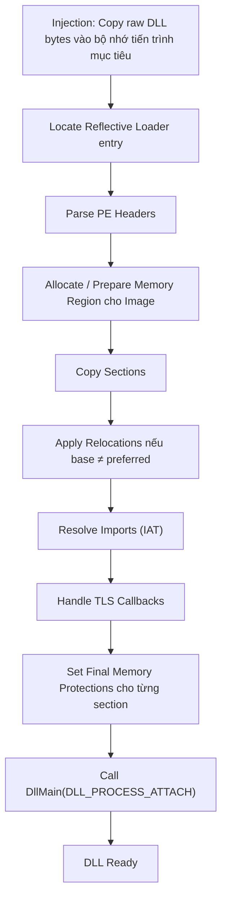
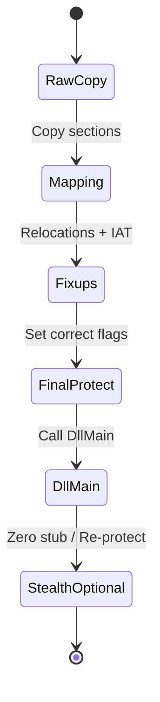
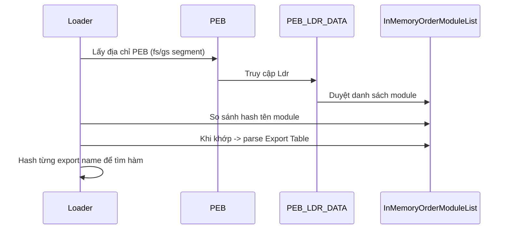
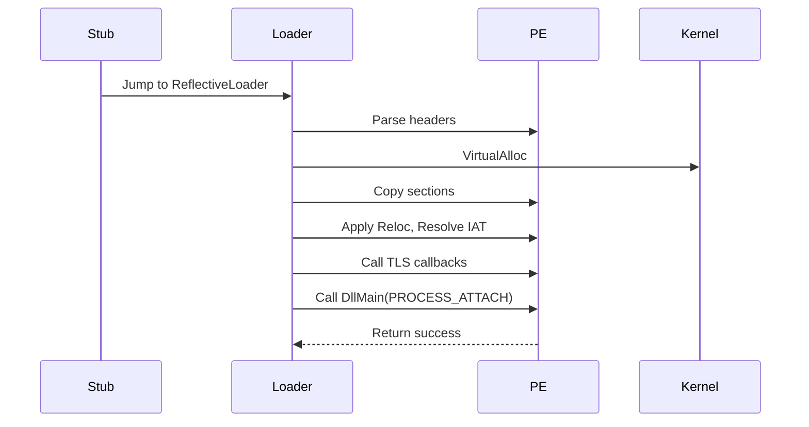
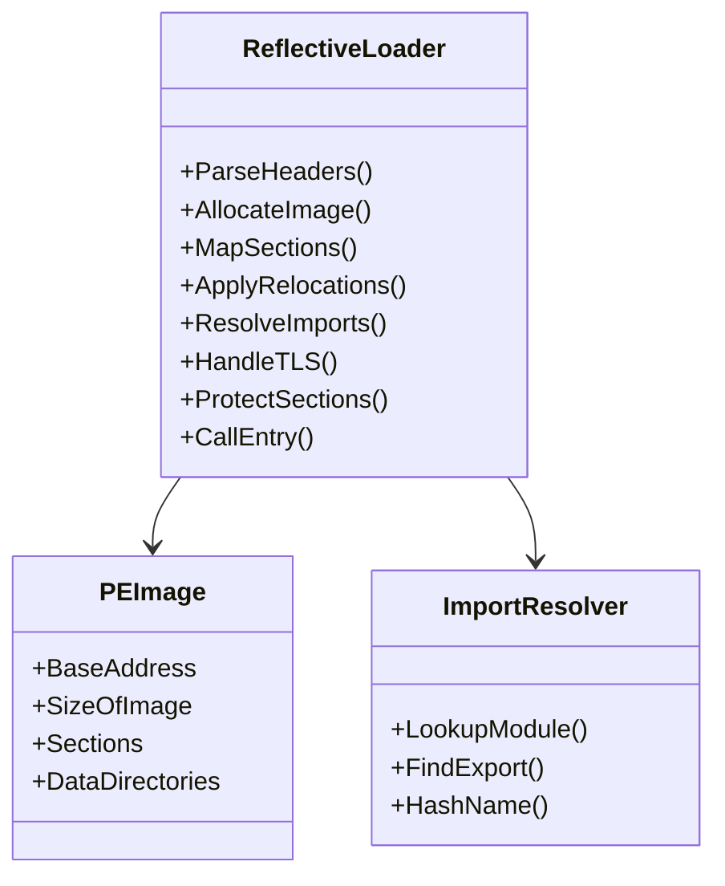

# Phân Tích Kỹ Thuật Reflective DLL Injection (RDI)
Repository: `tiendungdo12/ReflectiveDLLInjection` (Fork từ dự án gốc của Stephen Fewer)
Ngôn ngữ: C (100%)

> Báo cáo này tổng hợp chi tiết kỹ thuật Reflective DLL Injection (RDI) cùng các khía cạnh cơ bản và nâng cao, trình bày bằng sơ đồ, bảng và minh hoạ để dễ hiểu. Nội dung nhằm mục đích nghiên cứu bảo mật, không khuyến khích sử dụng sai mục đích.

---

## 1. Giới Thiệu Nhanh Về Reflective DLL Injection

Reflective DLL Injection (RDI) là kỹ thuật nạp (load) một DLL vào tiến trình (process) mục tiêu mà **không dùng trực tiếp `LoadLibrary`** của Windows. Thay vào đó, một phần mã gọi là "Reflective Loader" nằm ngay trong chính DLL sẽ tự thực thi để:

1. Tìm base address của chính DLL trong bộ nhớ (dữ liệu đã được đưa vào bằng kỹ thuật injection thô).
2. Parse cấu trúc PE (Portable Executable) của DLL.
3. Cấp phát vùng nhớ mới phù hợp (nếu cần) hoặc “self-map” tại vùng đã được copy.
4. Áp dụng relocations.
5. Resolve Import Address Table (IAT).
6. Thi hành TLS callbacks (nếu có).
7. Điều chỉnh lại thuộc tính bảo vệ vùng nhớ cho từng section.
8. Gọi hàm `DllMain` với lý do `DLL_PROCESS_ATTACH`.

Khác với cách injection truyền thống (`CreateRemoteThread + LoadLibraryA`), RDI **tránh để lộ đường dẫn DLL trên disk**, khó bị phát hiện qua hooking ở cấp API tiêu chuẩn.

---

## 2. Thành Phần Chính Của Một Implement RDI

| Thành phần | Vai trò | Ghi chú |
|------------|---------|--------|
| Shellcode / Stub inject | Đưa DLL thô vào không gian tiến trình mục tiêu và gọi địa chỉ loader | Có thể nén/mã hoá |
| Reflective Loader (hàm ví dụ: `ReflectiveLoader`) | Bộ não của kỹ thuật | Thường được export hoặc đặt tại offset xác định |
| PE Parser (thủ công) | Đọc DOS Header, NT Headers, Section Table | Thay thế chức năng loader của Windows |
| Relocation Handler | Điều chỉnh con trỏ khi base khác PreferredBase | Duyệt IMAGE_BASE_RELOCATION |
| Import Resolver | Tự gọi `GetProcAddress` & `LoadLibraryA/W` (thường truy xuất thông qua PEB) | Tránh dùng trực tiếp IAT sẵn không hợp lệ |
| TLS Handler | Gọi callback trước `DllMain` | Nếu DLL có TLS |
| Section Mapper | Copy từng section và set PAGE protections tương ứng | .text RX, .data RW, .rdata R |
| Entry Invoker | Gọi `DllMain(hInstance, DLL_PROCESS_ATTACH, NULL)` | Có thể tuỳ chọn gọi thêm logic hậu tải |
| Clean-up / Hardening (tùy chọn) | Xoá dấu vết, zero hoá stub | Nâng cao tính ẩn mình |

---

## 3. Dòng Chảy Hoạt Động (High-Level Flow)



---

## 4. Cấu Trúc PE Liên Quan

| Thành phần | Tên trong PE | Lý do cần trong RDI |
|------------|--------------|---------------------|
| DOS Header | IMAGE_DOS_HEADER | Lấy offset PE (`e_lfanew`) |
| NT Headers | IMAGE_NT_HEADERS | Thông tin machine, entry point, ImageBase, DataDirectory |
| Section Headers | IMAGE_SECTION_HEADER | Xác định kích thước/thuộc tính section |
| Data Directory | Import, Base Reloc, TLS, Exception... | Đầu vào cho các giai đoạn RDI |
| Optional Header | IMAGE_OPTIONAL_HEADER | `SizeOfImage`, `AddressOfEntryPoint`, `ImageBase` |
| Import Descriptor | IMAGE_IMPORT_DESCRIPTOR | Dùng resolve API |
| Reloc Blocks | IMAGE_BASE_RELOCATION | Fix con trỏ phụ thuộc base |
| TLS Directory | IMAGE_TLS_DIRECTORY | Thực thi callback |

---

## 5. Trạng Thái Vùng Nhớ & Quyền Bảo Vệ Theo Giai Đoạn

| Giai đoạn | Hành động | Quyền (phổ biến) | Ghi chú |
|-----------|-----------|------------------|--------|
| Injection Raw | Copy DLL bytes vào buffer ban đầu | PAGE_READWRITE (tạm) | Dễ thao tác |
| Mapping Sections | Di chuyển/copy từng section tới layout chuẩn | RW tạm thời | Chưa set thuộc tính chuẩn |
| Relocation & Import Fixup | Ghi patch vào .text/.data | PAGE_READWRITE hoặc PAGE_EXECUTE_READWRITE | Một số loader tạm bật RXW để đơn giản |
| TLS Callback Exec | Chạy callback | Tùy (đổi lại nếu cần) | Ít thay đổi |
| Finalization | Thiết lập chuẩn | .text => RX, .rdata => R, .data => RW, .pdata => R, custom => theo flags | Giảm bề mặt tấn công |
| Post-Stealth (tuỳ chọn) | Xoá stub/cipher stub hoặc đổi protection lại | PAGE_NOACCESS / R | Evasion |

Sơ đồ trạng thái quyền:



---

## 6. Chi Tiết: Thay Đổi Quyền Nhớ

1. Ban đầu dùng `VirtualAlloc` hoặc vùng đã có sẵn -> `PAGE_READWRITE`.
2. Khi cần ghi patch relocations, IAT:  
   - Một số implement set tạm `PAGE_EXECUTE_READWRITE` (dễ nhưng dấu hiệu đáng nghi).  
   - Implement tốt hơn: set chính xác từng section `.text` => `PAGE_EXECUTE_READ`, `.data` => `PAGE_READWRITE`, `.rdata` => `PAGE_READONLY`.
3. Sau hoàn tất, **nên** bỏ quyền ghi khỏi `.text` để hạn chế phát hiện qua heuristic (giảm pattern RXW).
4. Một số kỹ thuật nâng cao:  
   - Re-encrypt section rồi giải mã runtime.  
   - Đổi lại tham số `Protect` bằng `VirtualProtect` nhiều lần (tạo nhiễu hoặc che dấu trace API).  
5. Có thể không “set lại quyền” sau fixup ở implement đơn giản -> Dấu vết dễ bị forensic phát hiện.

---

## 7. So Sánh Với Kỹ Thuật Injection Khác

| Tiêu chí | LoadLibrary Injection | Manual Map / RDI | Process Hollowing |
|----------|-----------------------|------------------|-------------------|
| Phụ thuộc file trên disk | Có | Có thể không cần (nạp từ buffer) | Có (exe ban đầu) |
| Dễ bị detection bởi API Hook | Dễ | Ít hơn | Trung bình |
| Cần loader tự viết | Không | Có | Có |
| Xử lý relocations thủ công | Không | Có | Có |
| IAT Resolve tự viết | Không | Có | Có |
| Dấu vết trên `LoadedModules` | Có | Có thể không nếu không add PEB list | Không giống DLL truyền thống |
| Phức tạp | Thấp | Trung/Cao | Cao |

---

## 8. Phân Tích Bộ Phận Reflective Loader (Mẫu Logic)

```c
void* ReflectiveLoader(void* dllBaseRaw) {
    IMAGE_DOS_HEADER* dos = (IMAGE_DOS_HEADER*)dllBaseRaw;
    IMAGE_NT_HEADERS* nt = (IMAGE_NT_HEADERS*)((BYTE*)dllBaseRaw + dos->e_lfanew);

    SIZE_T imageSize = nt->OptionalHeader.SizeOfImage;
    void* mappedBase = VirtualAlloc(NULL, imageSize, MEM_COMMIT|MEM_RESERVE, PAGE_READWRITE);

    // Copy Sections
    CopyHeadersAndSections(dllBaseRaw, mappedBase, nt);

    // Relocations
    ApplyBaseRelocations(mappedBase, nt);

    // Import Resolution
    ResolveImports(mappedBase, nt);

    // TLS
    RunTLSCallbacks(mappedBase, nt);

    // Final Protections
    ProtectSections(mappedBase, nt);

    // Call Entry
    DLLMAIN entry = (DLLMAIN)((BYTE*)mappedBase + nt->OptionalHeader.AddressOfEntryPoint);
    entry((HINSTANCE)mappedBase, DLL_PROCESS_ATTACH, NULL);

    return mappedBase;
}
```

---

## 9. Giải Quyết Nhập Khẩu (Import Resolution) Không Dùng IAT Chuẩn

Để tránh dấu vết hoặc bị hook, loader có thể:
- Duyệt Process Environment Block (PEB) -> danh sách module -> so sánh hash tên.
- Tự viết hàm hash tên API (ví dụ: ROR13) thay vì so sánh plain string.
- Tránh gọi trực tiếp `LoadLibraryA` nếu module đã có trong PEB.

Sơ đồ truy xuất API qua PEB:



---

## 10. Relocations (Base Relocation Table)

- Khi `PreferredImageBase != mappedBase`, loader phải duyệt từng `IMAGE_BASE_RELOCATION` block.
- Mỗi entry: 12 bits offset, 4 bits type.
- Loại thường gặp: `IMAGE_REL_BASED_HIGHLOW` (32-bit), `IMAGE_REL_BASED_DIR64` (64-bit).
- Nếu bỏ qua: con trỏ vtable, hàm, dữ liệu toàn cục sẽ trỏ sai => crash.

Chi phí forensic: Relocation đúng giúp DLL “giống” module hợp lệ khi memory scan.

---

## 11. TLS Callbacks

- Trước khi gọi `DllMain`, nếu `IMAGE_DIRECTORY_ENTRY_TLS` tồn tại:
  - Lấy `AddressOfCallBacks` -> gọi lần lượt.
- Một số kỹ thuật ẩn: Nhúng payload chính vào TLS callback thay vì `DllMain` (tránh một số hook).

---

## 12. Entry Invocation & Thread Context

Hai kiểu:
1. Loader dùng `CreateRemoteThread` để gọi Reflective Loader => loader gọi `DllMain`.
2. Sử dụng thread sẵn, gọi trực tiếp entry -> khó detect hơn vì không t��o thread mới.

Sequence chi tiết:



---

## 13. Kỹ Thuật Nâng Cao & Evasion

| Kỹ thuật | Mô tả | Mục tiêu |
|----------|-------|----------|
| Hash-based API lookup | Tránh plaintext tên API | Evasion |
| RWX Window Minimization | Giảm thời gian section ở trạng thái RXW | Giảm detect heuristic |
| Unlink module khỏi PEB | Không hiển thị trong danh sách `LoadedModules` | Stealth |
| In-memory compression/encryption | Giải mã runtime | Evasion signature |
| Syscall trực tiếp | Bỏ qua userland hooks | EDR evasion |
| Delayed entry | Chờ điều kiện (mutex, thời gian) | Anti-sandbox |
| ETW/AMSI patching | Tắt logging | Evasion nâng cao |

---

## 14. Chỉ Báo Phát Hiện (IoCs) & Forensics

| Dấu hiệu | Mô tả | Khung phát hiện |
|----------|------|------------------|
| Vùng nhớ thực thi không có file backing | `MEM_IMAGE` flag khác thường hoặc private | Memory scan |
| Section RX nhưng không thuộc module trong PEB | Manual map | EDR |
| API chain bất thường (`VirtualAlloc` -> ghi -> `VirtualProtect` -> jump) | Hành vi injection | Behavior engine |
| Hash-based resolver patterns | Vòng lặp duyệt export + hash | Static heuristic |
| Tên module không khớp IAT | Suspicious mapping | Heuristic |
| DllMain bị gọi mà không thấy LoadLibrary | Manual mapping | Logging analysis |

---

## 15. Hardening (Phòng Thủ / Phản Công)

| Biện pháp | Phân tích |
|-----------|-----------|
| Hạn chế quyền `PROCESS_VM_WRITE`/`PROCESS_CREATE_THREAD` | Giảm khả năng injection |
| Monitor `VirtualAlloc` + `WriteProcessMemory` + `VirtualProtect` pattern | Behavior detection |
| Memory scan tìm PE header trong private region | Tìm loader ẩn |
| Hook `NtMapViewOfSection`, `NtProtectVirtualMemory`, `NtAllocateVirtualMemory` | Cấp độ kernel tốt hơn |
| ASLR + CFG | Cản bớt jump bất thường (CFG) |
| ETW-TI + Lsass monitoring | Ghi trace injection nếu chưa vô hiệu |

---

## 16. Điểm Mạnh & Điểm Yếu

| Mặt | Nội dung |
|-----|----------|
| Ưu | Không cần file trên disk, khó detect LoadLibrary hook, tuỳ biến cao |
| Nhược | Phức tạp, dễ lỗi reloc/IAT, dấu vết nếu bảo vệ bộ nhớ không chuẩn |
| Rủi ro | Sai sót bảo vệ => crash hoặc bị EDR phát hiện |
| Cải tiến khả dụng | Giảm thời gian RWX, ẩn khỏi PEB, encryption sections |

---

## 17. Khác Biệt Khi So Với “Classic Manual Mapping”

RDI chủ yếu áp dụng cho DLL **tự chứa loader** (self-reflective), trong khi “manual mapper” bên ngoài thường làm mọi thứ từ process khác. RDI tương thích tốt cho shellcode chain, fileless attacks, pivoting stage.

---

## 18. Minh Hoạ Bố Cục Bộ Nhớ (Giản Lược)

Trước (sau copy thô):

```
+-------------+---------------------+
| Raw Buffer  | DLL bytes (flat)    | RW
+-------------+---------------------+
```

Sau mapping & fixup:

```
+----------------------+-----------------------+
| .text                | CODE                  | RX
+----------------------+-----------------------+
| .rdata               | CONST DATA            | R
+----------------------+-----------------------+
| .data / .bss         | RW DATA               | RW
+----------------------+-----------------------+
| .reloc (có thể free) | Relocation info       | R / Freed
+----------------------+-----------------------+
| Heap (runtime alloc) | Strings, API names    | RW
+----------------------+-----------------------+
```

---

## 19. Các Sai Lầm Phổ Biến Khi Tự Viết Loader

| Lỗi | Hậu quả |
|-----|---------|
| Quên align section | Crash/vi phạm truy cập |
| Không xử lý đúng TLS | Logic DLL không chạy |
| Không chuyển quyền bảo vệ | EDR dễ phát hiện (RWX) |
| Bỏ reloc 64-bit | Con trỏ sai -> crash |
| Resolve import sai thứ tự | Dependency chain error |
| Không gọi `DllMain` | DLL không khởi tạo đúng |

---

## 20. Gợi Ý Cải Tiến Cho Repo Fork

1. Thêm tuỳ chọn “strict protection”: Không dùng RXW global.
2. Hash-based export resolution + whitelist module.
3. Optional: Unlink entry khỏi PEB (InLoadOrderModuleList).
4. Tạo test harness mô phỏng detection (chạy với ETW).
5. Thêm benchmark thời gian giữa các giai đoạn.
6. Thêm build config hỗ trợ x64 + CFG bypass research.

---

## 21. Mô Hình Trừu Tượng



---

## 22. Góc Nhìn Pháp Lý & Đạo Đức

- Dùng đúng mục đích: nghiên cứu bảo mật, Red Team, phát triển EDR test harness.
- Tránh sử dụng để ẩn mã độc truy cập trái phép.
- Log & kiểm soát môi trường lab.

---

## 23. Tóm Tắt Nhanh

- RDI = kỹ thuật tự nạp DLL thủ công trong tiến trình, không cần LoadLibrary.
- Loader xử lý PE: reloc, imports, TLS, section protections.
- Quyền nhớ chuyển từ RW -> (RWX tạm) -> RX/RW cuối.
- Evasion: hash API, unlink PEB, giảm thời gian RWX.
- Detection: memory forensic, pattern VirtualAlloc-Write-VirtualProtect, scanning PE headers trong private regions.
- Cải tiến: strict protection, encryption, direct syscall.

---

## 24. Tài Liệu / Tham Khảo (Khuyến Nghị Để Đọc Thêm)

(Chỉ mang tính định hướng, không trích nguyên văn)
- Original Stephen Fewer Reflective DLL Injection (blog & code).
- Windows Internals (PE format, loader).
- Malware analysis whitepapers on manual mapping.
- EDR detection methodology for memory injection.

---

## 25. Kết Luận

RDI là một kỹ thuật tinh gọn nhưng mạnh, cho phép nạp payload module một cách linh hoạt và khó phát hiện nếu triển khai cẩn thận (đặc biệt về quyền bộ nhớ và chuỗi gọi API). Tuy nhiên, chính việc phải tự tái hiện hành vi loader khiến dễ phát sinh sai sót — và cũng tạo nhiều điểm phát hiện hành vi cho các hệ thống phòng thủ hiện đại nếu không tinh chỉnh hợp lý. Việc hiểu sâu chu trình PE, reloc, IAT, TLS là nền tảng để tối ưu hoặc phòng thủ.

---

> Ghi chú: Báo cáo này nhằm mục đích học thuật & nâng cao nhận thức bảo mật. Mọi hành động sử dụng ngoài phạm vi hợp pháp tuân thủ luật hiện hành là không được khuyến khích.